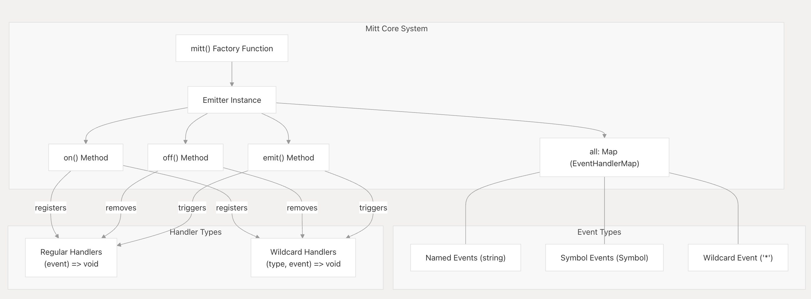

> 时隔了这么久，终于再次踏上了投简历面试的旅程了，总体来说这一次的面试自我评价比较差，一来是面试企业是外企，自己的英文水平现在真的是渣渣，要多练口语才行，二来还是对一些前端的基础知识掌握的非常不牢固，这次把面试官咨询的题目都总结一下，给自己一个温故知新的备忘

## 简单介绍一下React常用的hook

- **useState**: 管理组件的内部状态，实现视图的更新+视图的重渲染
- **useEffect**: 处理副作用（请求接口、定时器、DOM操作、订阅等）
  - 空依赖：每次渲染都执行
  - 空数组依赖：仅挂载和卸载执行
  - 依赖项：依赖变化的时候执行
- **useContext**: 跨层级共享数据
- **useRef**: 
  - 获取DOM的实例
  - 存储不变，更新不触发重渲染的变量
- **useMemo**：缓存计算的结果，避免昂贵的重复计算
- **useCallback**: 缓存函数，防止子组件不必要的渲染

## React hook能否在循环或者if中使用

不可以，React Hook 严格禁止在 if、for、while、循环、条件判断、嵌套函数 中调用。
React 靠调用顺序识别每一个 Hook，条件 / 循环会改变执行顺序，导致状态错乱、Bug 难以排查。
Hook 必须保证：每次组件渲染，Hook 执行顺序、数量完全一致。

## React 开发中，有哪些常用的优化方式

1. **React.memo 组件 memo 化**
作用：包裹函数组件，对 props 做浅比较，如果 props 未变化则跳过组件重渲染，等价于类组件的 PureComponent。
适用场景：纯展示组件、频繁被父组件渲染的子组件、长列表的列表项。
注意：仅浅比较引用类型，若 props 传入新的对象 / 函数，memo 会失效，需配合 useCallback / useMemo 使用。

2. **useCallback 缓存函数引用**
作用：缓存函数的引用地址，避免每次渲染生成新函数，导致子组件 memo 失效。
适用场景：传递给子组件的回调函数、作为 useEffect 依赖的函数。
误区：不是所有函数都需要包裹，它本身有内存开销，只在配合 memo / 依赖项时才有实际收益。

3. **useRef 存储非渲染数据**
作用：存储不需要触发视图更新的变量（如定时器 ID、DOM 引用、上一次的状态值、缓存数据）。
优势：修改 .current 不会触发组件重渲染，相比 useState 更适合存放与渲染无关的中间值。

### 列表与大数据渲染优化(重点)
长列表是前端最常见的性能瓶颈场景，核心优化思路是「只渲染可视区域」。
1. **正确使用 key 属性**
必须使用唯一稳定的 id 作为 key，禁止使用数组 index（尤其是列表会增删、排序时）。
错误的 key 会导致 DOM 节点错误复用、状态错乱、增加 DOM 操作开销。
2. **虚拟滚动（长列表核心方案）**
原理：只渲染视口内的列表项，非可视区域仅保留占位，大幅减少 DOM 节点数量。
常用库：react-window（轻量）、react-virtualized（功能全面）。
适用场景：数百条以上的长列表、表格、无限滚动。
3. **列表项 memo 化**
列表容器渲染时，默认所有子项都会重渲染。用 React.memo 包裹列表项组件，仅当单条 item 数据变化时才更新对应项。

## 介绍一下typescript中的泛型

一句话总结：泛型 = 类型占位符，让代码复用、类型安全，不用写多份重复代码，又不像 any 丢失类型校验

```typescript
// <T> 声明泛型 T
function fn<T>(arg: T): T {
  return arg;
}

// 调用时自动推导类型
fn(10)       // T = number
fn("hello")  // T = string
```

1. 格式：<T> 声明泛型，T 是类型占位符
2. 核心：类型复用 + 类型安全，替代 any
3. 约束：extends 限制泛型范围
4. 场景：函数、接口、类、React 组件 / 状态
5. 重点掌握：Partial/Pick/Omit/Record 四大内置工具泛型

### TS 内置很多常用泛型工具，日常开发大量使用：
- Partial<T>：把 T 所有属性变为可选
- Required<T>：把 T 所有属性变为必选
- Readonly<T>：所有属性只读
- Pick<T, K>：从 T 中挑选部分属性
- Omit<T, K>：从 T 中剔除部分属性
- Record<K, T>：构造键值对对象（最常用）

```typescript
interface Person {
  name: string;
  age: number;
}

// Partial 可选
type P1 = Partial<Person>; 

// Pick 挑选 name
type P2 = Pick<Person, "name">;

// Omit 剔除 age
type P3 = Omit<Person, "age">;

// Record 快速定义对象结构
type Obj = Record<string, number>;
const obj: Obj = { a: 1, b: 2 };
```

## 前端单元测试
> 因为简历里面写了我日常维护了相关npm包，所有面试官特意问我维护npm包的过程中，是否使用了单元测试

1. **概念**
单元测试：对代码中最小独立单元（函数、组件、工具方法）单独测试，验证逻辑是否符合预期，提前发现 BUG。
2. **主流框架 / 工具**
Jest：最主流，零配置友好，集成断言、模拟、覆盖率，React/Vue/ 原生通用
Vitest：Vite 生态首选，API 兼容 Jest，速度更快
Testing Library：配合 Jest/Vitest，测试组件行为（推荐，贴近用户使用）
Enzyme：老牌组件测试库，现在使用变少
3. **核心作用**
- 保障代码修改后原有功能不失效（防改崩）
- 快速回归测试，减少人工重复验证
- 倒逼代码拆分、解耦，提升可维护性
- 生成测试覆盖率，直观查看未测代码

```javascript
// 待测试函数
function add(a, b) {
  return a + b;
}

// 单元测试用例
test('两数相加', () => {
  expect(add(1, 2)).toBe(3);
});
```
4. 简单原则
- 一个用例只测一个逻辑点
- 输入、输出、边界值（空、异常、极值）都覆盖
- 外部依赖（接口、定时器）使用Mock 模拟

## 低代码平台相关

### 组件之间的数据沟通和交互

利用了订阅库的机制，来进行互通数据和调用组件之间的逻辑
具体方法可以参考https://deepwiki.com/developit/mitt


| 方法/属性 | 描述 |
| --- | --- |
| mitt() | 创建一个新的事件订阅实例的工厂函数 |
| emitter.all | 存储事件类型到处理器数组的映射 |
| emitter.on() | 为特定事件类型注册事件处理函数 |
| emitter.off() | 移除特定事件类型的事件处理函数 |
| emitter.emit() | 触发指定事件类型的所有处理函数 |

### 微前端

> 之前工作主要接触的微前端形式：用Web Component标签,然后请求url拿到代码数据后，填充到web component中去，面试官特意问了我，在平常工作中，使用微前端最常遇到的问题是什么，是怎么解决的，我自己答的还是不够完善

这种「自定义 Web Component 标签 + 远程请求 URL + 把 HTML/JS 插入组件内部」的方案，本质是简易版的微前端实现，核心依赖 Shadow DOM 做样式隔离，但缺少完整的沙箱、路由、生命周期等配套能力。如果是手写原生实现，会存在以下几类明显缺点：

1. **全局变量完全共享**
子应用的脚本直接在主应用的 window 上执行，所有全局变量、全局方法（如挂载在 window 上的工具库、全局配置）会互相覆盖。多个子应用同时存在时，极易出现变量冲突、状态串扰。

2. **全局事件 / 定时器无法自动清理**
子应用绑定的 window 事件、setInterval、订阅监听等，在组件销毁 / 子应用卸载时不会自动清除，极易造成内存泄漏，重复进入还会导致事件重复绑定、逻辑执行多次。

3. **DOM 查询失效**
如果使用 Shadow DOM 封闭内部 DOM，子应用代码里的 document.getElementById、document.querySelector 等全局查询会全部失效 —— 因为 Shadow DOM 内部节点对全局 document 不可见，需要改造为从 Shadow Root 下查询，旧系统改造成本极高。

## 手写代码题目

> 需求是顶部有一个checkbox，可以全选或不全选列表项，列表条目也有一个checkbox，来勾选是否需要勾选对应列表项，然后页面底部显示已选择的列表项

```typescript
  import {useState,useEffect} from 'react';

  export default function Comps(){
    interface ListItem {
        id:string,
        name:string
    }

    const listdata:ListItem[] = [
      { id: '1', name: '张三' },
      { id: '2', name: '李四' },
      { id: '3', name: '王五' },
    ]

    const [chooseItems,setchooseItems] = useState<ListItem[]>([]);

    const isCheckAll = listdata.length > 0  && chooseItems.length === listdata.length;

    const chooseAllList = (e)=>{
      setchooseItems(e.target.checked?[...listdata]:[])
    }
    const chooseList = (checked:boolean,item:ListItem)=>{
        if(checked){
          setchooseItems([item,...chooseItems])
        }else{
          setchooseItems(chooseItems.filter(lisitem=>lisitem.id!==item.id))
        }
    }

    return (
      <div>
        是否全选列表
        <input type="checkbox" checked={isCheckAll} onChange={chooseAllList} />
        列表选择
        <ul>
          {listdata.map(item=><li key={item.id}>{item.name}<input type="checkbox" checked={chooseItems.some(choseitem=>choseitem.id===item.id)} onChange={(e)=>{chooseList(e.target.checked,item)}} /></li>)}
        </ul>
        已选择的列表
        <ul>
          {chooseItems.map(item=><li>{item.name}</li>)}
        </ul>
      </div>
    )
  }
```