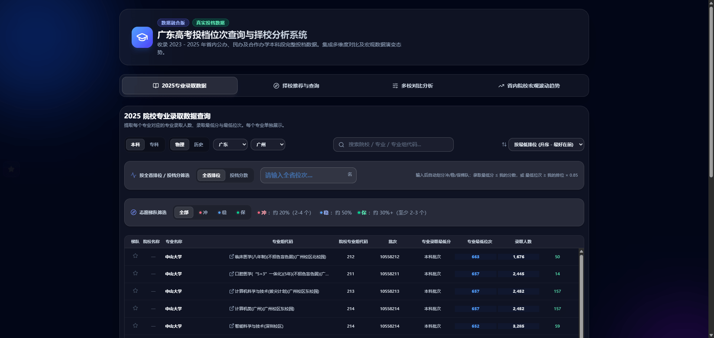
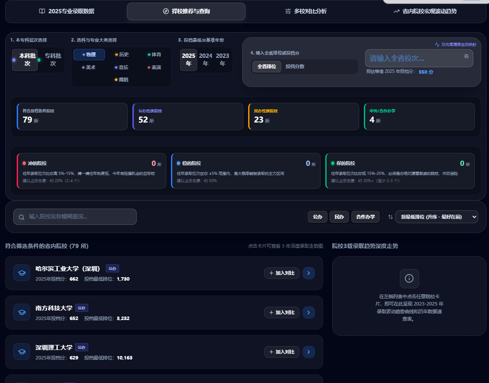
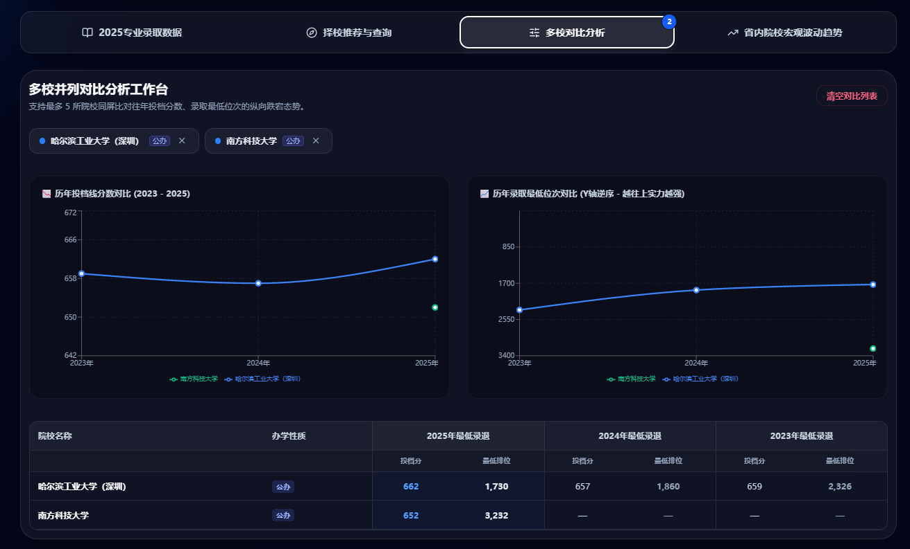
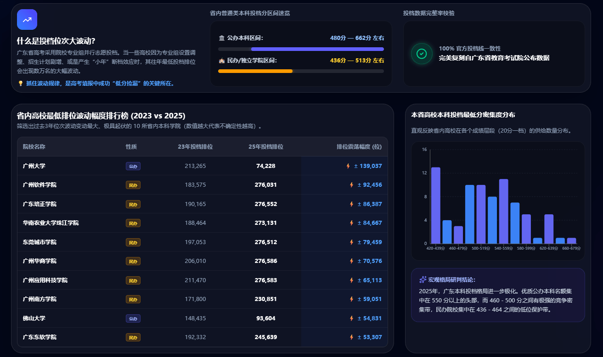
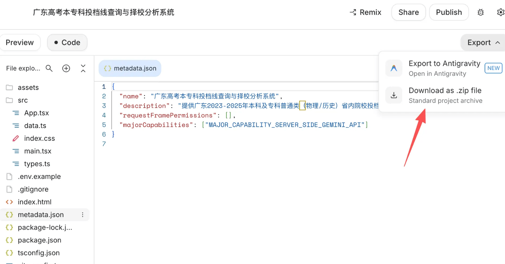

> 数据来源：[广东高考近3年投档分数+最低排位汇总](https://mp.weixin.qq.com/s/LAz0Sw4WsWea4iAftHr9_g)、[艺体类！广东高考近3年投档分数+最低排位](https://mp.weixin.qq.com/s/g_-ugAZtVlpy0ae8IKekiQ)

又到一年一度的高考成绩放榜时间了，各位考生们又到了人生的关键路口，选择自己心仪高校的时候了，结合了2023-2025年三年的投档数据，给各位考生做了一个**广东高考投档位次查询与择校分析系统**

## 项目地址

<https://gaokaoscore.mrfangge.com/>

> 欢迎提pr：<https://github.com/fangge/gaokaoscore>



## 功能简介

### 1. 智能择校推荐与查询

*   **分数 / 排位双向智能换算**：输入全省排位即可预估等值投档分，输入投档分亦可反推全省排位，基于 2023—2025 年真实数据点进行插值计算。
*   **多维度筛选与排序**：支持院校名称模糊搜索、办学性质（公办 / 民办 / 合作办学）多选筛选，以及按排位、分数、拼音等多维排序。
*   **院校 3 年录取趋势深度走势**：点击任一院校即可查看其 2023—2025 年投档分数变化曲线与最低排位走势图（排位轴已反转，直观体现「越往上越难」），并附历年数据速查表与录取符合性判别。



### 2. 多校对比分析

*   支持最多 **5 所院校**同屏并列比对。
*   提供历年投档线分数对比曲线、历年录取最低位次对比曲线（Y 轴逆序）双图表。
*   输出对比矩阵表，三年投档分与最低排位一目了然，便于横向评估院校录取难度梯度。



### 3. 省内院校宏观波动趋势

*   **投档位次波动幅度排行榜**：筛选 2023 vs 2025 年位次震荡最剧烈的 10 所省内本科院校，帮助识别「断档」「小年」等机会点。
*   **投档最低分密集度分布**：以 20 分一档呈现省内高校供给数量分布，直观展现各成绩段的竞争密集带。
*   **宏观格局研判**：结合公办 / 民办投档分区间速览与数据完整率校验，给出省内本科投档格局的整体研判结论。



### 4. 2025 院校专业录取数据查询

*   **数据来源**：解析2025 年专业录取数据，提取每个专业对应的「专业录取最低分」「专业最低位次」「专业录取人数」（专业级别数据，每个专业不同）。
*   **展示字段**：院校名称、专业全称、专业组代码、院校专业组代码、批次、专业录取最低分、专业最低位次、专业录取人数。
*   **按科类分别加载**：历史与物理数据拆分为独立 JSON 文件（`groupData-history.json` / `groupData-physics.json`），切换科类时按需加载，避免一次性加载全部数据。
*   **收藏与导出**：用户筛选专业组数据后，可点击星标按钮收藏感兴趣的专业组。左侧固定滑出面板集中展示已收藏列表，支持逐条移除、一键清空及一键导出 CSV 文件（BOM UTF-8，Excel 友好）。收藏数据通过 `localStorage` 持久化，刷新不丢失，方便考生反复比对心仪志愿。
*   **筛选与展示规则**：
    *   默认仅展示当前科类前 **20** 条记录；
    *   用户输入搜索关键词（院校 / 专业 / 专业组代码）、全省排位或投档分数后，直接展示全部匹配结果；
    *   排位/分数筛选规则：专业录取最低分 ≤ 我的分数，或 最低位次 ≥ 我的排位。
*   **性能优化**（应对 3.4 万+ 条专业记录）：
    *   **虚拟列表**：基于 `react-virtualized` 仅渲染屏幕可见的 DOM 节点，避免全量渲染卡顿；
    *   **Web Worker 离线计算**：筛选、排序逻辑放入独立 Worker 线程执行，不阻塞主线程渲染与交互；
    *   **搜索防抖**：输入框搜索延迟 300ms 触发，减少无效数据遍历；
    *   **IndexedDB 本地缓存**：数据首次加载后写入浏览器 IndexedDB，二次访问优先读取本地缓存，秒开免重新解析。


## 实现过程

1.  访问[Google AIstudio](https://aistudio.google.com/)
2.  提示词: 严格参考图片中表格的数据，生成一个可交互的图表，方便用户筛选年份和报考物理或者历史，输入自己的排位后，可以展示对应的可报学校
3.  现在**aistudio**还会贴心地咨询你需要哪种风格的样式
4.  生成完成后，选择code面板，直接下载源码



5.  上传github后，再结合github action,实现提交后自动构建，然后将构建好的dist文件夹里面的内容发布到gh-page分支，并发布到github page

```
name: Deploy to GitHub Pages

on:
  push:
    branches: [main]

# 设置GITHUB_TOKEN的权限
permissions:
  contents: write
  pages: write
  id-token: write

jobs:
  build-and-deploy:
    runs-on: ubuntu-latest
    steps:
      - name: Checkout
        uses: actions/checkout@v4

      - name: Install pnpm
        uses: pnpm/action-setup@v4

      - name: Setup Node.js
        uses: actions/setup-node@v4
        with:
          node-version: 22
          cache: 'pnpm'

      - name: Install dependencies
        run: pnpm install --frozen-lockfile

      - name: Build
        run: |
          pnpm build
          touch dist/.nojekyll

      - name: Deploy to GitHub Pages
        uses: JamesIves/github-pages-deploy-action@v4
        with:
          folder: dist
          branch: gh-pages

```

7.  在github的设置页中，找到github page设置，关联自己的域名即可
